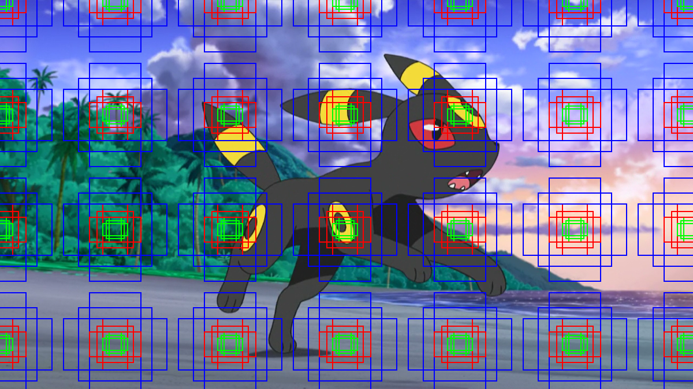

# Anchors JAX 🔍⏹

Anchors JAX is a simple Python package fully implemented with JAX to simplify the generation
of anchors for object detection models such as [Faster-RCNN](https://arxiv.org/abs/1506.01497), 
[SSD](https://arxiv.org/abs/1512.02325), [RetinaNet](https://arxiv.org/abs/1708.02002), etc.

## Anchors? What are they? ⚓

The first Deep Learning based Object detectors, used to depend on external modules to
generate region proposals (image regions that probably contain objects of interest). 
For example, the [RCNN](https://arxiv.org/abs/1311.2524) paper, describes how the authors
used the Selective Search algorithm to retrieve the region proposals within the given 
images. *Old fashioned* object detectors usually had a pipeline composed of 2 steps:

- The aforementioned region proposal extraction
- The classification and regression of the regions actually containing objects of interest, such a *dog*.

Since the first pipeline stage is slow and non-trainable, the new object detectors 
prefer to avoid this first step. To remove this step and further improve the old
detectors performance, this new model architectures introduce the **anchor** concept.

Depending on the article and the model architecture the **anchor** definition might slightly change, but
the most *common* definition is the one defined in the [FasterRCNN](https://arxiv.org/abs/1506.01497) paper:

> At each sliding-window location, we simultaneously
predict multiple region proposals, where the number
of maximum possible proposals for each location is
denoted as $k$. `...` The k proposals are parameterized relative to k reference boxes, which we call
**Anchors**.  An anchor is centered at the sliding window
in question, and is associated with a scale and aspect
ratio.  By default we use 3 scales and
3 aspect ratios, yielding $k = 9$ anchors.

## What does Anchors JAX provide? ✨

- Code to generate anchor or prior boxes for multiple algorithms (SSD, FasterRCNN, RetinaNet, etc.)
- Pertrained models ready to train along with the optimizable loss function to finetune them.
- Object detection data augmentation.
- Complex operations such as Non Maxima Supression and IoU
- Utility functions to work with object detection tasks.

### Pretrained models

Anchors JAX implements some of the most famous models and also provides 
pretrained weights for them.

```python
import jax
import haiku as hk
import anchors_jax as aj

def forward(im):
  # By default coco weights
  net = aj.zoo.SSD(pretrained=True,
                   num_classes=81, 
                   k=[4, 6, 6, 6, 4, 4])
  return net(im)


rng = jax.random.PRNGKey(0)
ssd = hk.without_apply_rng(hk.transform(forward))
params = ssd.init(rng, jax.random.uniform(rng, shape=(1, 300, 300, 3)))
```

## Examples

```python
from PIL import Image
import anchors_jax.faster_rcnn as aj
import anchors_jax.viz as viz

im = Image.open('images/umbreon.png')
anchors = aj.generate_anchors(im.size[::-1], stride=stride, **kwargs)
viz.draw_boxes(im, anchors, 
               boxes_width=2, 
               colors=[viz.Color.Red, viz.Color.Green, viz.Color.Blue]).show()
```


